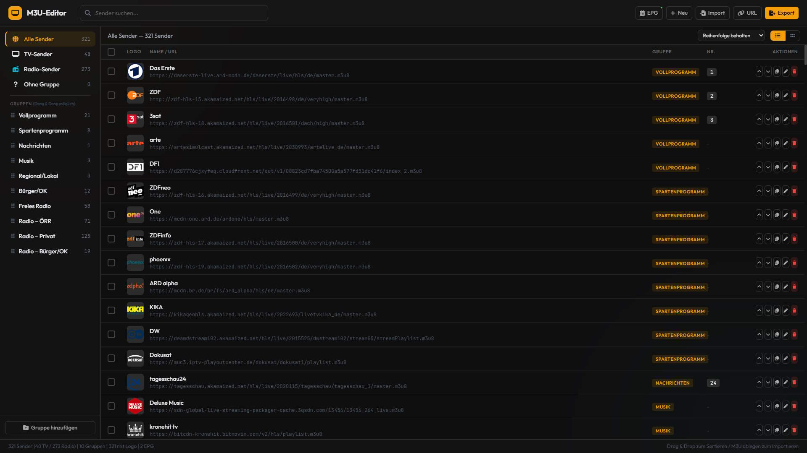

# M3U-Editor
Ein Editor für M3U-Playlisten

---

Ein Editor um M3U-Playlisten zu erstellen und zu Sortieren. Dieser Editor ist für Playlisten optimiert, die TV- und Radio-Programme enthalten. Diese Playliste kann dann z. B. in KODI genutzt werden.

## Screenshot ##

